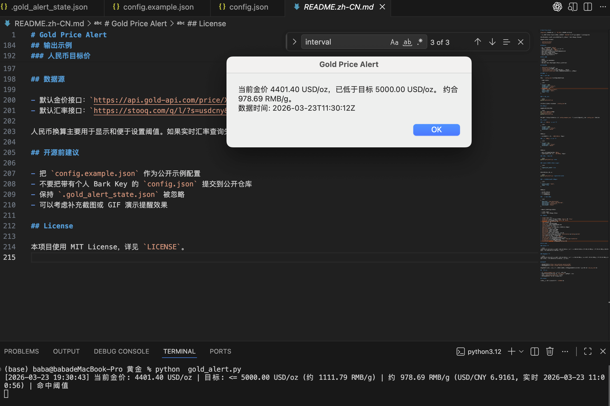

# Gold Price Alert

[English](./README.md) | [简体中文](./README.zh-CN.md)

一个轻量级 Python 工具，用来监听国际金价 `XAU/USD`，在价格到达你的目标值后发送提醒。

这个项目适合在 macOS 和 Windows 上做个人金价提醒，也支持通过 Bark 推送到 iPhone。

推荐的 GitHub 仓库名：

- `gold-price-alert`
- `xau-price-alert`

## 功能特性

- 监听实时国际金价 `USD/oz`
- 支持用 `USD/oz` 或 `RMB/g` 作为目标价
- 自动把国际金价换算为 `RMB/g`
- 支持 macOS 和 Windows 本地提醒
- 可选 Bark 推送到 iPhone
- 可选忽略命中缓存，命中即提醒
- 不依赖第三方 Python 包

## 运行要求

- macOS 或 Windows
- Python 3.9 或更高版本
- 网络连接
- 如果要用 Bark 推送，需要 iPhone 上安装 Bark

## 项目文件

- `gold_alert.py`：主脚本
- `config.json`：本地运行配置
- `config.example.json`：示例配置，可用于开源发布
- `assets/gold-price-alert-demo.png`：提醒弹窗和终端输出效果图
- `.gold_alert_state.json`：运行时生成的状态文件，用于去重提醒

## 效果图



## 快速开始

### 1. 修改配置

先打开 `config.json`，修改你关心的字段。

一个最小示例：

```json
{
  "target": 4000,
  "target_unit": "usd_oz",
  "direction": "below",
  "interval": 10,
  "name": "Gold Price Alert",
  "notify_mode": "both",
  "beep": true,
  "beep_sound": "Ping"
}
```

### 2. 运行脚本

```bash
python3 gold_alert.py
```

脚本会自动读取当前目录下的 `./config.json`。

## 安装方式

不需要安装额外依赖。

```bash
git clone <你的仓库地址>
cd gold-price-alert
python3 gold_alert.py
```

如果你准备发布到 GitHub，建议把 `config.example.json` 放进仓库。如果 `config.json` 里包含个人密钥，发布前先清空敏感字段。

## 开机自启动

### macOS

项目里已经提供了 `launchd/com.fchangjun.gold-price-alert.plist`。

### 1. 安装启动项

```bash
mkdir -p ~/Library/LaunchAgents
cp /Users/baba/Desktop/黄金/launchd/com.fchangjun.gold-price-alert.plist ~/Library/LaunchAgents/
launchctl unload ~/Library/LaunchAgents/com.fchangjun.gold-price-alert.plist 2>/dev/null || true
launchctl load ~/Library/LaunchAgents/com.fchangjun.gold-price-alert.plist
```

### 2. 立即启动

```bash
launchctl start com.fchangjun.gold-price-alert
```

### 3. 停止

```bash
launchctl stop com.fchangjun.gold-price-alert
```

### 4. 禁用并移除开机启动

```bash
launchctl unload ~/Library/LaunchAgents/com.fchangjun.gold-price-alert.plist
rm ~/Library/LaunchAgents/com.fchangjun.gold-price-alert.plist
```

### Windows

项目里已经提供了 `windows/start_gold_price_alert.bat`。

你可以通过“任务计划程序”设置开机或登录后自动启动：

1. 打开“任务计划程序”
2. 新建任务
3. 触发器选择“登录时”
4. 操作选择“启动程序”
5. 程序路径指向 `windows/start_gold_price_alert.bat`
6. 保存

也可以用 PowerShell 创建：

```powershell
$action = New-ScheduledTaskAction -Execute "C:\path\to\gold-price-alert\windows\start_gold_price_alert.bat"
$trigger = New-ScheduledTaskTrigger -AtLogOn
Register-ScheduledTask -TaskName "GoldPriceAlert" -Action $action -Trigger $trigger -Description "Start Gold Price Alert at logon"
```

## 查看日志

默认日志会写到项目目录下：

- `logs/gold-price-alert.log`
- `logs/gold-price-alert.error.log`

实时查看：

```bash
tail -f /Users/baba/Desktop/黄金/logs/gold-price-alert.log
```

错误日志：

```bash
tail -f /Users/baba/Desktop/黄金/logs/gold-price-alert.error.log
```

## 运行中修改 target

现在脚本已经支持自动重载 `config.json`。

你只需要修改：

```json
{
  "target": 4800
}
```

保存后，脚本会在下一次轮询时自动重新加载配置，不需要手动重启。

日志里会看到类似输出：

```text
[2026-03-23 20:10:00] 已重新加载配置: /Users/baba/Desktop/黄金/config.json
```

## 使用教程

### 使用 `USD/oz` 作为目标价

```json
{
  "target": 4000,
  "target_unit": "usd_oz",
  "direction": "below"
}
```

这表示：

- 当国际金价小于等于 `4000 USD/oz` 时提醒

### 使用 `RMB/g` 作为目标价

```json
{
  "target": 950,
  "target_unit": "cny_g",
  "direction": "above"
}
```

这表示：

- 先把实时国际金价换算成 `RMB/g`
- 当换算后的价格大于等于 `950 RMB/g` 时提醒

### 只运行一次做测试

```bash
python3 gold_alert.py --once
```

### 忽略命中缓存，每次命中都提醒

```json
{
  "ignore_hit_cache": true
}
```

或者直接命令行运行：

```bash
python3 gold_alert.py --ignore-hit-cache
```

### 使用更强的 macOS 本地提醒

```json
{
  "notify_mode": "both",
  "beep": true,
  "beep_sound": "Ping"
}
```

这表示：

- 发通知中心横幅
- 弹出确认对话框
- 播放终端蜂鸣声

### 开启 Bark 推送

```json
{
  "bark_key": "your-device-key",
  "bark_server": "https://api.day.app",
  "bark_group": "gold-alert",
  "bark_sound": "alarm"
}
```

配置后，每次触发提醒时会：

- 在 Mac 上提醒
- 同时通过 Bark 推送到 iPhone

## 配置说明

- `target`：目标价格
- `target_unit`：目标价格单位，支持 `usd_oz` 或 `cny_g`
- `direction`：触发方向，支持 `above` 或 `below`
- `interval`：轮询间隔，单位秒
- `name`：通知标题
- `source_url`：金价接口地址
- `state_file`：提醒去重状态文件路径
- `once`：是否只检查一次后退出
- `ignore_hit_cache`：是否忽略命中缓存，命中就提醒
- `bark_key`：Bark 设备 Key
- `bark_server`：Bark 服务地址
- `bark_group`：Bark 消息分组
- `bark_sound`：Bark 提示音名称
- `bark_url`：点击 Bark 通知后打开的链接
- `notify_mode`：本机提醒方式，支持 `notification`、`dialog`、`both`
- `beep`：提醒时是否播放系统提示音
- `beep_sound`：提示音名称，例如 `Ping`、`Glass`、`Hero`
- `use_live_fx`：是否启用实时 `USD/CNY`
- `usd_cny_rate`：实时汇率失败时的手动兜底值
- `fx_provider`：实时汇率解析器，目前支持 `stooq`、`frankfurter`
- `fx_source_url`：实时汇率接口地址
- `fx_refresh_interval`：汇率刷新间隔，单位秒

## 输出示例

### 美元目标价

```text
[2026-03-23 19:23:26] 当前金价: 4362.40 USD/oz | 目标: <= 4000.00 USD/oz (约 889.43 RMB/g) | 约 970.01 RMB/g (USD/CNY 6.9161, 实时 2026-03-23 11:00:56) | 未命中
```

### 人民币目标价

```text
[2026-03-23 19:21:52] 当前金价: 4371.40 USD/oz | 目标: >= 950.00 RMB/g | 当前折算: 972.02 RMB/g | 约 972.02 RMB/g (USD/CNY 6.9161, 实时 2026-03-23 11:00:56) | 命中阈值
```

## 数据源

- 默认金价接口：`https://api.gold-api.com/price/XAU`
- 默认汇率接口：`https://stooq.com/q/l/?s=usdcny&i=1`

人民币换算主要用于显示和便于设置阈值。如果实时汇率查询失败，脚本会回退到配置中的 `usd_cny_rate`。

## 开源前建议

- 把 `config.example.json` 作为公开示例配置
- 如果 `config.json` 里有个人字段，公开前先清空
- 保持 `.gold_alert_state.json` 被忽略
- 可以考虑补充截图或 GIF 演示提醒效果

## License

本项目使用 MIT License，详见 `LICENSE`。
